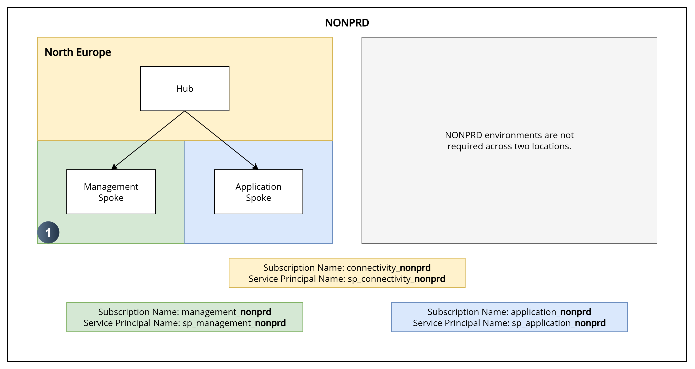
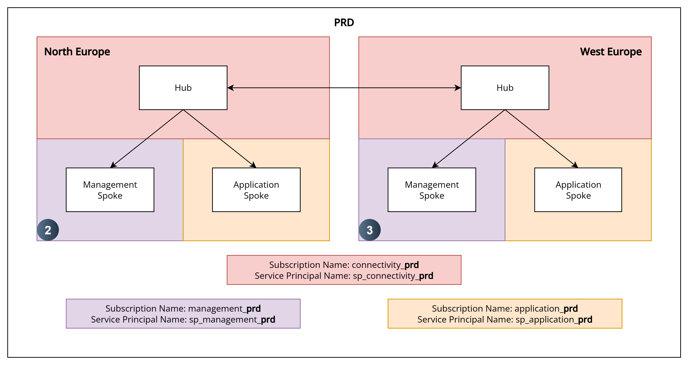

# Terraform State Design

## 1. Environments
---

Imagine you have the design below. Where should you place your Terraform state files?

#### 1.1 NONPRD



#### 1.2 PRD




## 2. Design Considerations
---

The following considerations should be taken into account when designing a remote state structure:

- 'Nonprd' is a collective term for all nonprd environments e.g. dev, tst, uat etc.  
  To keep costs down, a hub for example could service dev, tst and uat environments under the banner 'nonprd'.

- 'Prd' is a collective term for all prd environments e.g. prd, dr etc.  
  To keep costs down, a hub for example could service prd and dr environments under the banner 'prd'.

- When it comes to the application spokes however, you are more likely to see them segregated as dev, tst, uat, prd and dr.

- A ```.tfvars``` file contains the configuration for what you'd like to deploy; it maps to a ```.tfstate``` file.  

- A ```.tfvars``` file should only contain resources from a single region.  
  
  Why is this?  
  If all regions were managed in a single state file, a failure in one region would impact Terraforms ability to query and manage resources in other regions.  
  If a region fails, Terraform cannot communicate with the resources in that region.  
  When ```terraform plan``` or ```terraform apply``` runs, it queries the cloud provider using the management api and compares the actual deployed infrastructure against the state file.  
  If a region is down, Terraform will be unable to query that regions resources resulting in the plan/apply failing.

- A ```.tfvars``` file should only contain resources for a single environment e.g. nonprd, prd, dev, tst, uat, prd, dr etc.  
  
  Why is this?  
  Managing environments separately ensures clear separation, reduces risk and improves operational stability. In the event of a failure or misconfiguration in one environment, the other environment remains unaffected.  
  Isolating environments also supports safer CI/CD workflows, where promotion to environments is controlled and auditable.

- A ```.tfvars``` file should be clearly named to indicate the environment and region.  
  This is mainly a cosmetic requirement to avoid confusion when working with multiple files in vscode.  
  e.g. if all files were named ```main.tfvars``` it would be unclear which environment or region you are working on.

## 3. Storage Account and Container Design
---

Given the considerations above, your storage account and container design could look something like the table below.  

The reference numbers refer to the numbers on the diagram above ^^^.  

The naming convention is just an example. Follow your organisations naming convention.  

The container name is named after the repo. It is prefixed with plz (Platform Landing Zone) or alz (Application Landing Zone) for segregation and clarity.

The table below should be scaled to suit designs with less / more regions or environments.  

| Ref # | Resource Group Name    | Storage Account Name   | Container Name               | Statefile Name                             | Notes                           |
|-------|------------------------|------------------------|------------------------------|--------------------------------------------|---------------------------------|
| 1     | rg-nonprd-nteu-tfstate | sardznonprdnteutfstate | plz-010-mgmt-logging         | nonprd-nteu.tfstate                        |                                 |
|       |                        |                        | plz-020-mgmt-groups-policies | nonprd-nteu.tfstate                        |                                 |
|       |                        |                        | plz-030-mgmt-automation      | nonprd-nteu.tfstate                        |                                 |
|       |                        |                        | plz-040-hub                  | nonprd-nteu.tfstate                        |                                 |
|       |                        |                        | plz-050-firewall             | nonprd-nteu.tfstate                        |                                 |
|       |                        |                        | plz-060-shared-services      | nonprd-nteu.tfstate                        |                                 |
|       |                        |                        | alz-010-aks-lz               | dev-nteu.tfstate, tst-nteu.tfstate         |                                 |
|       |                        |                        | alz-020-aks-clusters         | dev-nteu-blu.tfstate, tst-nteu-blu.tfstate |                                 |
|       |                        |                        | alz-040-front-door           | nonprd-nteu.tfstate                        |                                 |
| 2     | rg-prd-nteu-tfstate    | sardzprdnteutfstate    | plz-010-mgmt-logging         | prd-nteu.tfstate                           |                                 |
|       |                        |                        | plz-020-mgmt-groups-policies | prd-nteu.tfstate                           | only required in primary region |
|       |                        |                        | plz-030-mgmt-automation      | prd-nteu.tfstate                           |                                 |
|       |                        |                        | plz-040-hub                  | prd-nteu.tfstate                           |                                 |
|       |                        |                        | plz-050-firewall             | prd-nteu.tfstate                           |                                 |
|       |                        |                        | plz-060-shared-services      | prd-nteu.tfstate                           |                                 |
|       |                        |                        | alz-010-aks-lz               | prd-nteu.tfstate                           |                                 |
|       |                        |                        | alz-020-aks-clusters         | prd-nteu-blu.tfstate, prd-nteu-grn.tfstate |                                 |
|       |                        |                        | alz-040-front-door           | prd-nteu.tfstate                           | only required in primary region |
| 3     | rg-prd-wteu-tfstate    | sardzprdwteutfstate    | plz-010-mgmt-logging         | prd-wteu.tfstate                           |                                 |
|       |                        |                        | plz-030-mgmt-automation      | prd-wteu.tfstate                           |                                 |
|       |                        |                        | plz-040-hub                  | prd-wteu.tfstate                           |                                 |
|       |                        |                        | plz-050-firewall             | prd-wteu.tfstate                           |                                 |
|       |                        |                        | plz-060-shared-services      | prd-wteu.tfstate                           |                                 |
|       |                        |                        | alz-010-aks-lz               | prd-wteu.tfstate                           |                                 |
|       |                        |                        | alz-020-aks-clusters         | prd-wteu-blu.tfstate, prd-wteu-grn.tfstate |                                 |

## 4. Local Repo Folder Structure
---

The folder structure to support the structure above would look something like the example below.

#### 4.1 NONPRD/PRD Example (Taken From 010-mgmt-logging)

```
repo-root/
├── environments/
│   ├── nonprd/
│   │   └── nteu/
│   │       └── nonprd-nteu.tfvars
│   ├── prd/
│   │   ├── nteu/
│   │   │   └── prd-nteu.tfvars
│   │   └── wteu/
│   │       └── prd-wteu.tfvars
├── 001-terraform.tf
├── 002-variables.tf
├── 003-locals.tf
├── 004-data-sources.tf
├── 010-avm-ptn-alz-management.tf
├── 020-role-assignment.tf
├── 030-avm-res-storage-storageaccounts.tf
├── 040-avm-res-keyvault-vaults.tf
└── 999-outputs.tf
```

#### 4.2 DEV, TST, UAT & PRD Example (This is what an application spoke repo could look like e.g. 010-aks-lz)

```
repo-root/
├── environments/
│   ├── dev/
│   │   └── nteu/
│   │       └── dev-nteu.tfvars
│   ├── tst/
│   │   └── nteu/
│   │       └── tst-nteu.tfvars
│   └── prd/
│       ├── nteu/
│       │   └── prd-nteu.tfvars
│       └── wteu/
│           └── prd-wteu.tfvars
├── 001-terraform.tf
├── 002-variables.tf
├── 003-locals.tf
├── 004-data-sources.tf
├── 010-avm-res-resources-resourcegroup.tf
├── 020-etc-etc.tf
├── 030...
└── 999-outputs.tf
```
