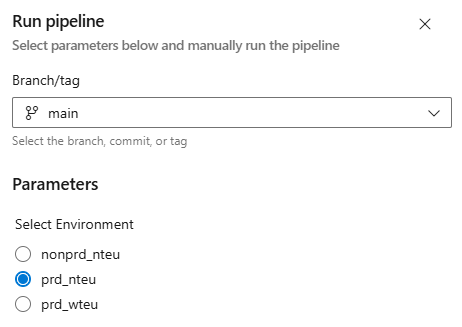
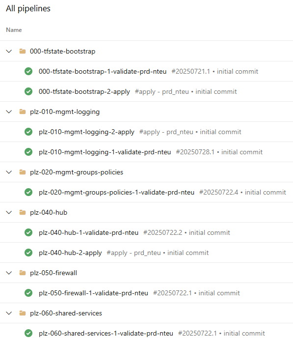

# Terraform Folder and File Structure

## 1. Environments
---

Explained here [Terraform State Design](1-terraform-state-design.md)

## 2. Terraform Files

The local file structure should look simlar to below.

```
repo-root/
├── environments/
├── pipelines/
├── 001-terraform.tf
├── 002-variables.tf
├── 003-locals.tf
├── 004-data-sources.tf
├── 010-avm-res-resources-resourcegroup.tf
├── 020-etc-etc.tf
├── 030...
└── 999-outputs.tf
```

### 2.1 File Prefixing

- The ```.tf``` files are prefixed in the order the resources are created. This makes it easy to see the dependency flow without digging into the code.

- ```001, 002, 003, 004 and 999``` are fixed; they'll always be those numbers.

- The main resources are separated in 10's. ```010``` will be your first resource. This could be resource groups, but if you're deploying to an existing resource group it will be the first resource type you are deploying.  
Separating resources in 10's provides room either side to slot in items in the future. Always pick the middle gap to allow for future slotting e.g. if you want to go between ```010``` & ```020```, pick ```015```. If the project isn't live yet you may prefer to renumber sticking with 10's.

- If using AVM modules, name the file after the AVM module, e.g:  
```010-avm-res-resources-resourcegroups.tf```  
If not using AVM modules, just call it what it is e.g:  
```070-front-door.tf```.

### 2.2 TFVARS Files

- The pipelines will run commands like below to reference the environment specific ```.tfvars``` files.
```
terraform plan -var-file="environments/nonprd/nteu/nonprd-nteu.tfvars"
```

## 3. Pipeline Strategy
---

### 3.1 File Structure

```
repo-root/
└── pipelines/
    ├── 1-validate-nonprd-nteu.yaml
    ├── 1-validate-prd-nteu.yaml
    ├── 1-validate-prd-wteu.yaml
    ├── 2-apply.yaml
    ├── 2-applyVariables.yaml
    ├── 9-destroy.yaml
    └── templates/
        ├── apply.yaml
        ├── common-after.yaml
        ├── common-before.yaml
        ├── common-init-plan-destroy.yaml
        ├── common-init-plan.yaml
        ├── common-test.yaml
        ├── destroy.yaml
        └── validate.yaml
```

### 3.2 The Pipelines

There are three types of pipeline, 'Validate', 'Apply' and 'Destroy'. There are also a number of helper templates that get called; but these don't need interacting / updating. They are mostly identical across all repos.

- **The 'Validate' Pipelines.**  

  A validate pipeline must exist for each combination of environment and region.  
  Each pipeline is set as a pull request validation pipeline on the repo, with a path filter to only trigger on changes to it own ```.tfvars``` file.  

  e.g. the '1-validate-prd-nteu.yaml' pipeline will have the following pull request path filter:  
  ```/*.tf; /environments/prd/nteu/*```  

  This validation pipeline will automatically trigger for a pull request if a ```.tf``` file is changed or it's own ```.tfvars``` file.  

  A validation pipeline should be added for each ```.tfvars``` file.  

  

- **The 'Apply' Pipeline.**  

  This is a single pipeline that is parameterised and manually run. You select the environment you'd like to deploy to when you run the pipeline.  
  

- **The 'Destroy' Pipeline.**  

  This is a single pipeline that is parameterised and run manually. You select the environment you'd like to destroy to when you run the pipeline.

### 3.3 Pipeline Organisation

Pipelines are organised into folders named after the repo.


