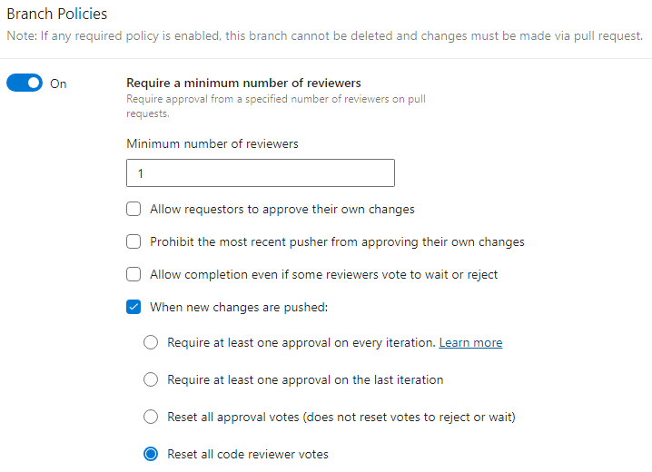
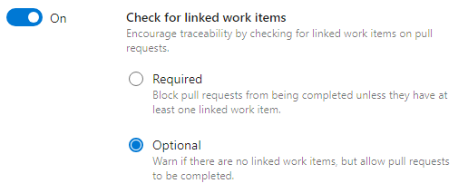
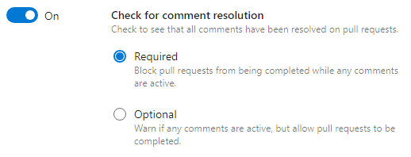
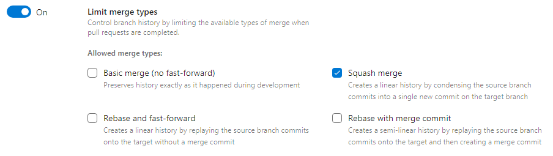
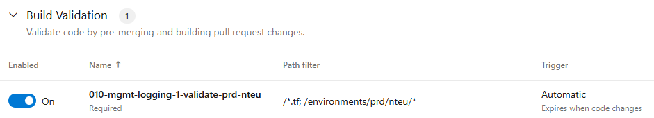
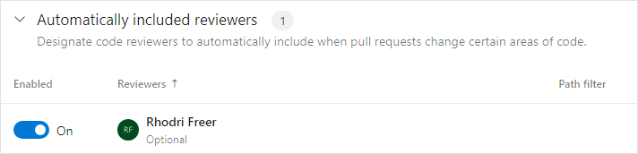
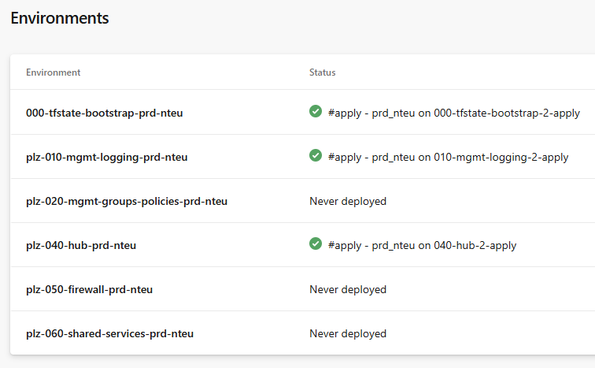
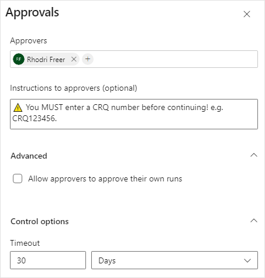

# Azure DevOps

## 1. Governance
---

The following settings should be implemented to enforce governance.

### 1.1 Branch Policies (main)
  
  
  


### 1.2 Build Validation (main)



### 1.3 Automatically Included Reviewers (main)

Select an appropriate list of users or groups and set as optional. The 'Minimum Number of Reviewers' set above will enforce.



### 1.4 Environments

Create a deployment environment for each of your environments and name appropriately.

The naming format for environments is:
[repo_name]-[environment]-[region]
e.g. plz-010-mgmt-logging-prd-nteu

The apply pipeline expands this with this line:
``` environment: "$(repoName)-$(environment)-$(region)" ```



Update 'Approvals and Checks' to add approvers.

If you add individuals, everyone you add here MUST approve so chose sparingly.  
If you add groups only a single individual is required to approve.

Add any appropriate instructions e.g. ⚠️ You MUST enter a CRQ number before continuing! e.g. CRQ123456.


