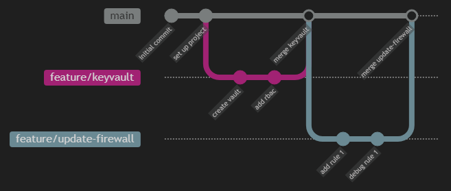

# Branching Strategy

## 1. Branching Strategy
---

To support the pipeline strategy a simple branching strategy can be followed; this is Github Flow.

<!-- ::: mermaid
gitGraph
  checkout main
  commit id: "initial commit"
  commit id: "set up project"
  branch feature/keyvault
  checkout feature/keyvault
  commit id: "create vault"
  commit id: "add rbac"
  checkout main
  merge feature/keyvault id: "merge keyvault"
  branch feature/update-firewall
  commit id: "add rule 1"
  commit id: "debug rule 1"
  checkout main
  merge feature/update-firewall id: "merge update-firewall"
::: -->

## 2. Example Workflow
---

### 2.1 The 'Validate' Step

1. Clone the repo.
2. Create a new branch from main e.g. feature/update-firewall.
3. Make your changes & test locally.
4. Commit to source control.
5. Create a pull request. The validation pipeline will automatically run.
6. If the validation pipeline succeeds, request review & approval.
7. Complete the pull request.
8. Your branch is now merged to main.

### 2.2 The 'Apply' Step

Due to environmental differences the 'Apply' pipeline doesn't run automatically. It's parameterised so you need to select the environment when you run it.

1. Run the 'Apply' pipeline.
2. Select the environment you want to deploy to.
3. Approve the environment deployment when prompted.
4. Terraform will now apply your changes.
