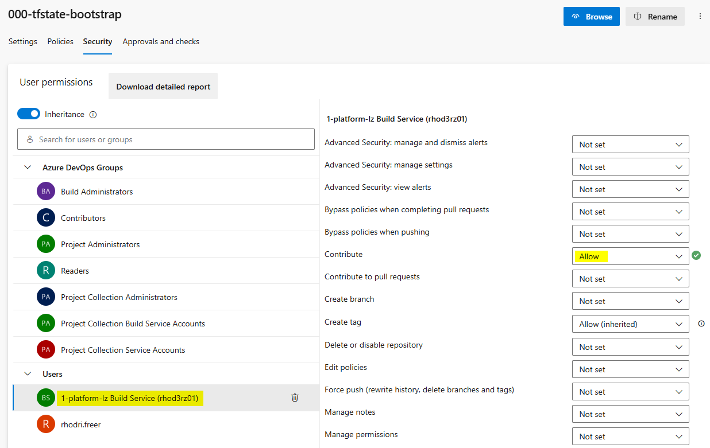

# Oddities Of This Repo

## 1. Local State File
---

When you start a terraform project you don't have a remote state location. Options to create this are:
- ClickOps
- Custom Script
- Terraform (with local state files)

For this project, terraform with local state files has been chosen.  

Because this repo uses local terraform state, the pipelines are slightly different to the other project repo pipelines. The main differences being the path to the state files and some additional steps to commit the state back to the repo when the apply pipeline runs.  

## 2. Non Standard Pipeline Extras
---

- As we're using a local state file, the pipeline code is slightly different to:

  handle the path to the local state file

  commit the state file changes back to the repo.

- The following permission must be set for the repo build service to allow it to git push the state files back to the repo.

