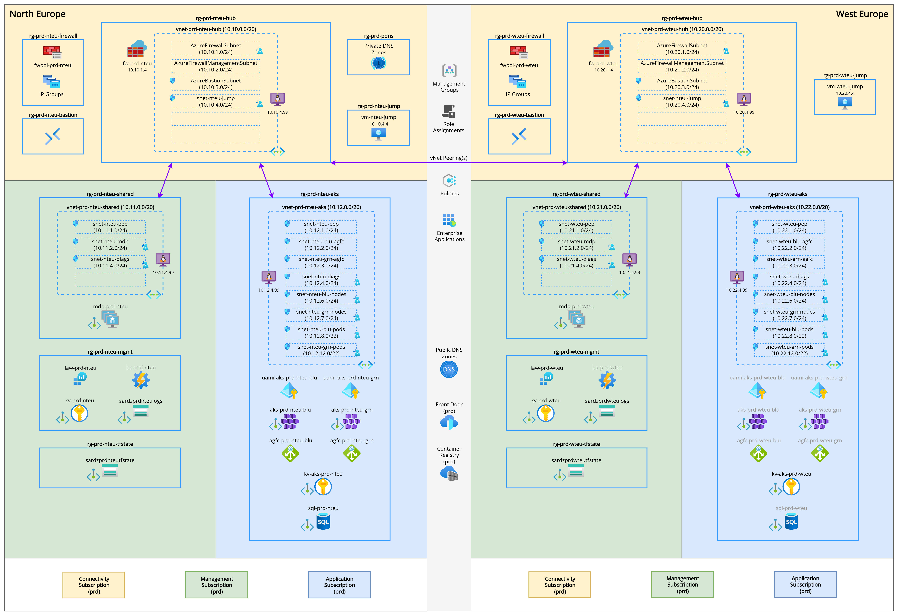

# Azure Landing Zone - Platform & Application

## 1. Summary
---

This solution demonstrates the deployment of an **Enterprise Scale Azure Landing Zone (ALZ)** using **Infrastructure as Code**, aligned with Microsoft's **Cloud Adoption Framework (CAF)** guidelines. It showcases a modular and scalable architecture suitable for running production grade workloads in Azure, including AKS-based microservices, centralised governance and multi-region resiliency.

More information about Microsoft's Cloud Adoption Framework can be found here:  
👉 https://learn.microsoft.com/en-us/azure/cloud-adoption-framework/ready/landing-zone

> **NOTE:** For the purposes of this demo, the solution is split across three repositories as listed below. In a real-world implementation, each demo repository would typically map to an Azure DevOps project, and each folder to an individual Azure DevOps repository.

| Repo                         | Description                                                                                                            |  URL                                                       |
|------------------------------|------------------------------------------------------------------------------------------------------------------------|------------------------------------------------------------|
| **Platform Landing Zone**    | Deploys the foundational platform: network hubs, firewalls, DNS, logging, policy and build agents.                     | https://github.com/rhod3rz/demo-1-platform-landing-zone    |
| **Application Landing Zone** | Deploys the application lz: app spokes, AKS clusters, private endpoints and supporting services (e.g. AGC, Key Vault). | https://github.com/rhod3rz/demo-1-application-landing-zone |
| **Applications**             | Deploys the applications: sample code and deployment pipelines for AKS based micro service apps.                       | https://github.com/rhod3rz/demo-1-applications             |

## 2. Components
---

The solution aligns with Microsoft's **Cloud Adoption Framework (CAF)** and includes the following core components, grouped by architectural pillars:

### 🌐 Network Architecture
- **Hub and Spoke Network Model** deployed per region.
- **Private DNS Zones** and **Private Endpoints** for secure service access.
- **Azure Firewall** for outbound control and logging.
- **NAT Gateway** used where appropriate for egress management.

### 📦 Platform & Application Hosting
- **Azure Kubernetes Service (AKS)** clusters in North and West Europe.
- **West Europe** acts as a **Standby Region** - an AKS cluster can be spun up rapidly for failover if required.
- **AKS Networking Mode** is configurable between **Azure CNI Overlay**, **Pod Subnet**, and **Node Subnet** models, depending on IP requirements.
- **Blue/Green AKS Clusters** with traffic routing managed via **Azure Front Door** for zero-downtime deployments.
- **Application Gateway for Containers (AGC)** for secure, scalable ingress.
- **Azure Front Door** also serves as the global entry point, offering WAF and cross-region traffic control.
- **Key Vault Integration** enables AKS workloads to securely consume secrets via CSI driver and workload identity.
- **Certificate Management** via cert-manager ensures automated TLS lifecycle for microservices.

### 🗂️ Subscription & Resource Organisation
- **Dedicated Subscriptions** per role:
  - `Connectivity` - networking, firewall, DNS
  - `Management` - monitoring, policy, identity, build agents
  - `Application` - workloads, AKS, app resources
- **Management Groups** aligned to CAF hierarchy for RBAC and policy inheritance.

### 🔐 Governance & Security
- **Azure Policy** initiatives for compliance.
- **Role-Based Access Control (RBAC)** implemented across Azure scopes and integrated with **Azure AD** for Kubernetes-level access control within AKS.
- **Checkov** to analyse Terraform configurations for misconfigurations and security issues.

### 📈 Monitoring & Operations
- **Log Analytics Workspaces** for centralised logging and metrics.
- **Azure Monitor for Containers** integrated with AKS for workload-level metrics, logging, and health monitoring.
- **Activity Logs** and **Diagnostic Settings** routed centrally.
- **Prometheus** and **Grafana** deployed within AKS for advanced monitoring, alerting and observability.

### 🤖 DevOps & Automation
- **Terraform** used for modular, reusable infrastructure-as-code across platform and application layers, with remote state stored securely in a dedicated resource group. The structure supports reuse across environments and tiers (e.g. dev, tst, prd).
- **Azure Verified Modules** used for consistent, well-tested infrastructure provisioning aligned with Microsoft best practices.
- **Managed Azure DevOps Agent Pools** deployed to private subnets in the management subscription.
- **YAML Based, Templated CI/CD pipelines** orchestrate end-to-end infrastructure and application deployment across all landing zone components.
- **Docker Based Applications** are built and pushed to **Azure Container Registry (ACR)** as part of the CI/CD pipeline.
- **Helm** and **Kustomize** used for application packaging and environment-specific configuration overlays.
- **GitOps Ready Architecture** – application deployments use Kustomize overlays, making GitOps integration (e.g. Flux or Argo CD) straightforward to adopt.

## 3. Architecture Overview  
---

The diagram below illustrates the high-level architecture of the Azure Landing Zone, showing the hub-and-spoke network topology, AKS deployments, regional separation, and core shared services.

👉 Click the image to view full size.

